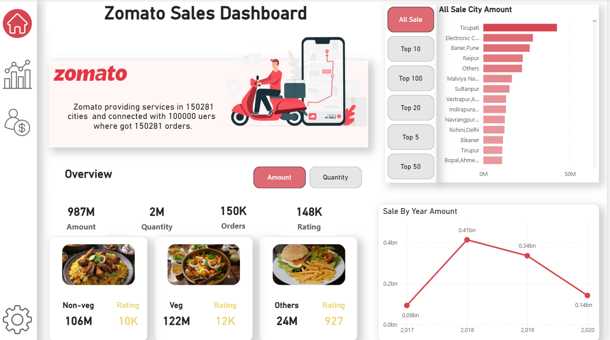
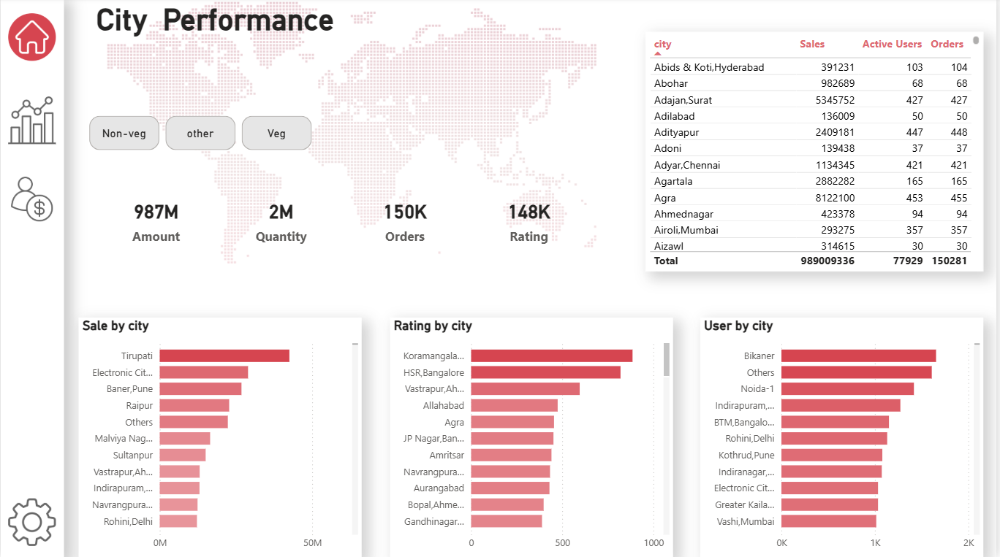
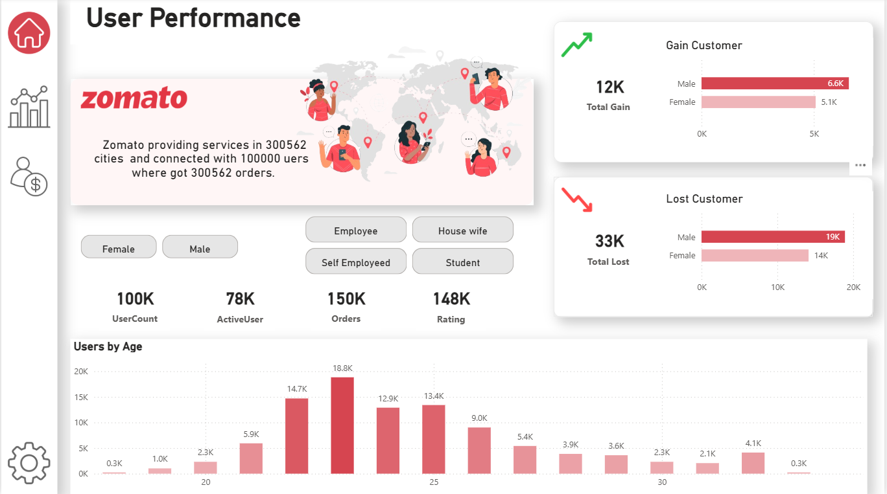

# 🍽️ Zomato Sales & User Analytics Dashboard

This repository presents a **Power BI dashboard project** that analyzes Zomato-style food delivery data. It includes insights about **sales performance, user behavior, city-wise distribution**, and **food category preferences** using a curated set of Excel datasets.

> 📌 **Note:** This project is a **self-driven independent work** and is **not part of any internship**. It was created solely for educational, analytical, and portfolio purposes.

---

## 📂 Files Included

| File Name          | Description |
|--------------------|-------------|
| `Zomato.pbix`      | Power BI file with complete interactive dashboards |
| `users.xlsx`       | User data including demographics and engagement |
| `restaurant.xlsx`  | Restaurant location and identity data |
| `menu.xlsx`        | Menu items for each restaurant |
| `food.xlsx`        | Food categories/types (Veg, Non-Veg, Others) |
| `orders.xlsx`      | Transactional order-level data |
| `orders_Type.xlsx` | Categorization of orders by type (Online, Dine-in, etc.) |

---

## 📊 Dashboard Highlights

### 1. **Overall Sales Dashboard**
- **Total Revenue:** ₹987M+
- **Total Orders:** 150K+
- **Total Quantity Sold:** 2M+
- **Rating Distribution:** 148K ratings
- **Food Type Breakdown:** Non-veg (106M), Veg (122M), Others (24M)

---

### 2. **City Performance Dashboard**
- City-wise Sales, Ratings, and Active Users
- Filters by food category (Veg / Non-Veg / Other)
- Bar charts for **Sales by City**, **Ratings by City**, and **Users by City**
- Interactive table listing top cities with sales & user metrics

---

### 3. **User Performance Dashboard**
- Total Users: 100K  
- Active Users: 78K  
- Gain vs Lost Customers by Gender  
- User Segmentation by Profession (Employee, Student, Housewife, etc.)  
- User Distribution by Age

---

## 📌 Objectives

- Clean and integrate multiple structured Excel datasets.
- Visualize key business KPIs using DAX & Power Query.
- Provide executive-level insights through filters, slicers, and visual storytelling.
- Simulate real-world analytics scenarios for food-tech platforms.

---

## 🧰 Tools & Technologies

- **Power BI Desktop** for dashboards and modeling  
- **Excel** for data preparation  
- **Power Query** for transformation logic  
- **DAX** for calculated measures & KPIs  

---

## 🚀 Getting Started

1. Clone/download this repository.
2. Open the `Zomato.pbix` file in Power BI Desktop.
3. Ensure all Excel files are in the same directory as the `.pbix`.
4. Hit **Refresh** to load or update the dataset.

---

## 🙋‍♂️ Author

**Your Name**  
📧 Email: *your.email@example.com*  
🔗 LinkedIn: [linkedin.com/in/yourprofile](https://linkedin.com/in/yourprofile)

---

## ⚠️ Disclaimer

- All data is fictional and used solely for educational purposes.
- This project is not associated with Zomato or any real company.
